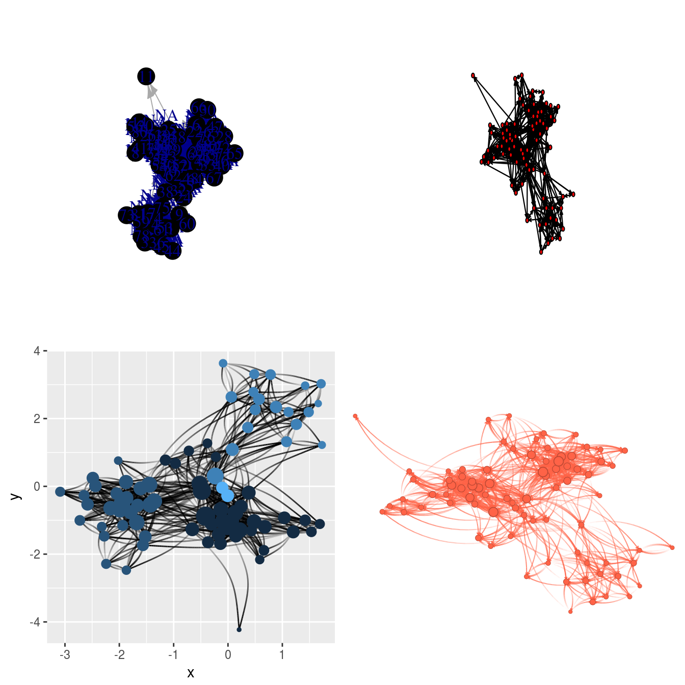
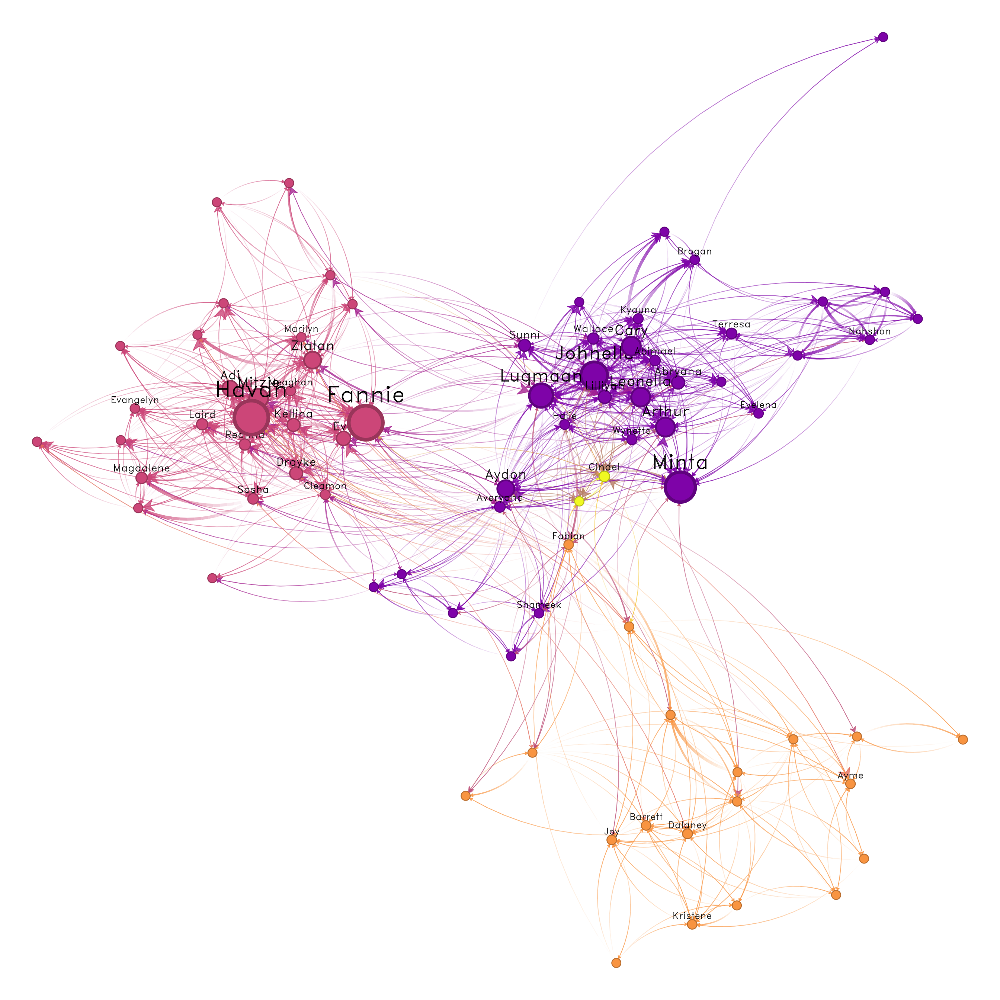
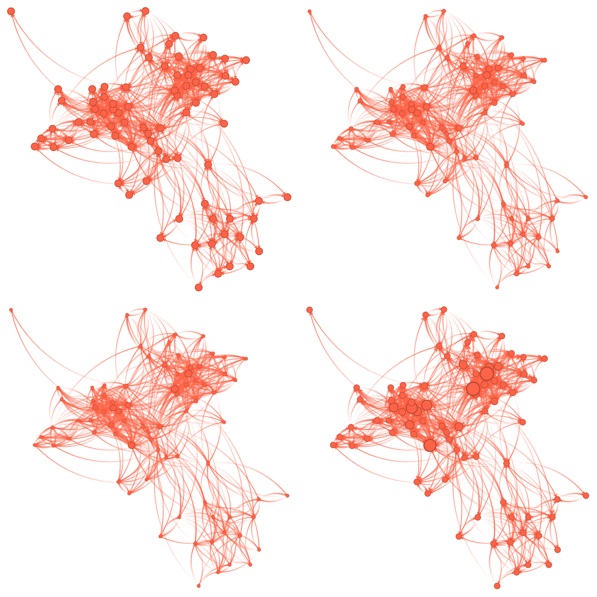
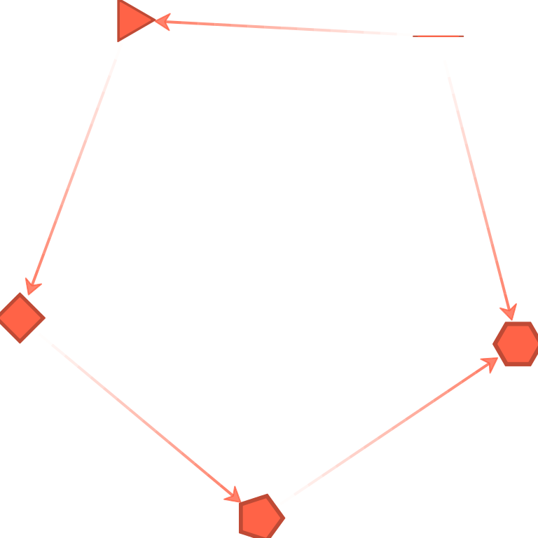
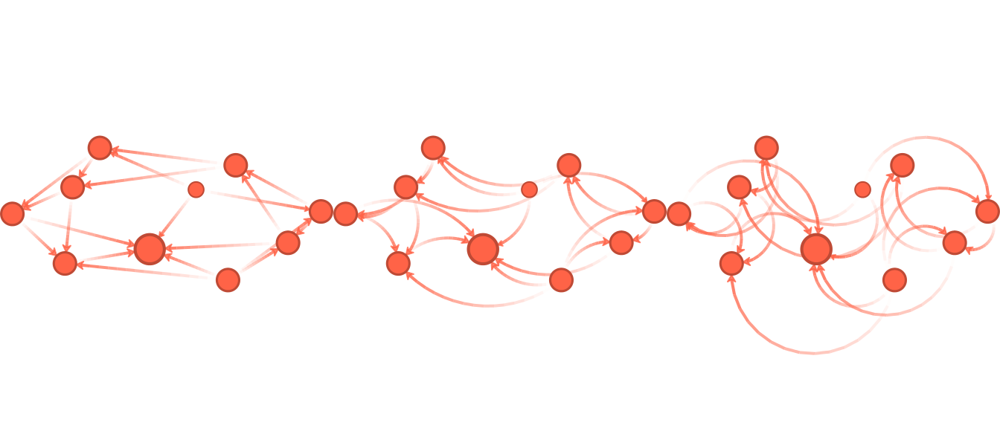
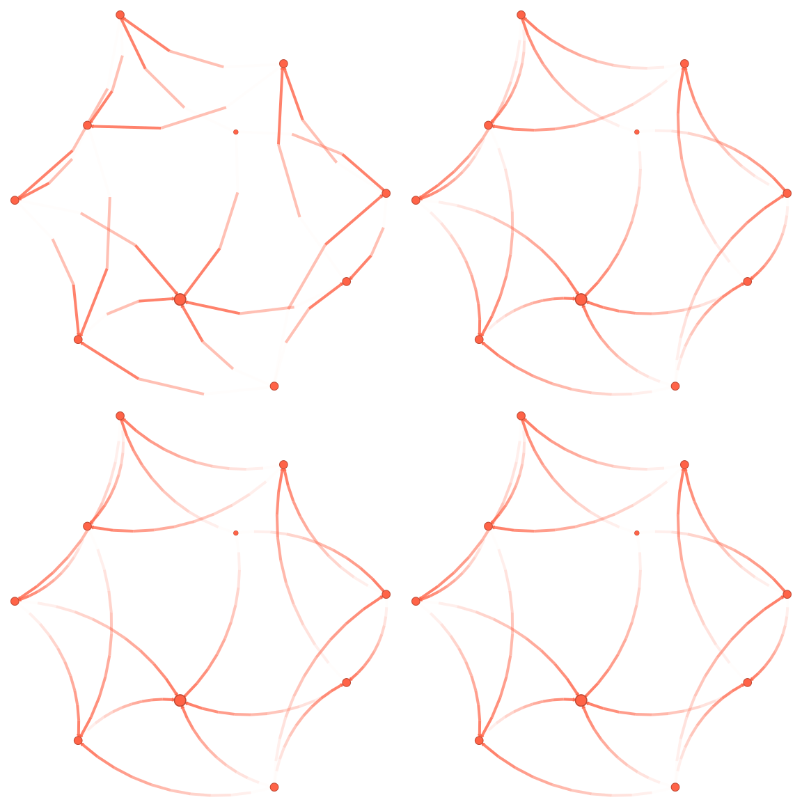
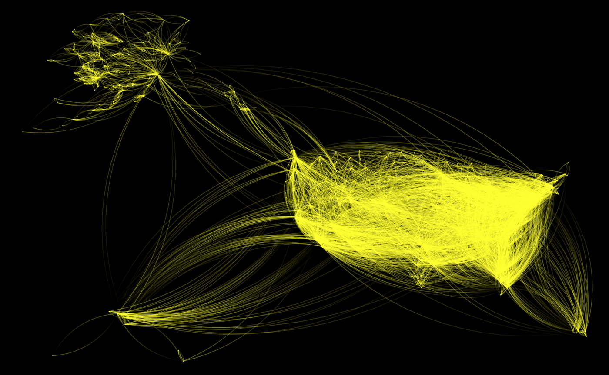
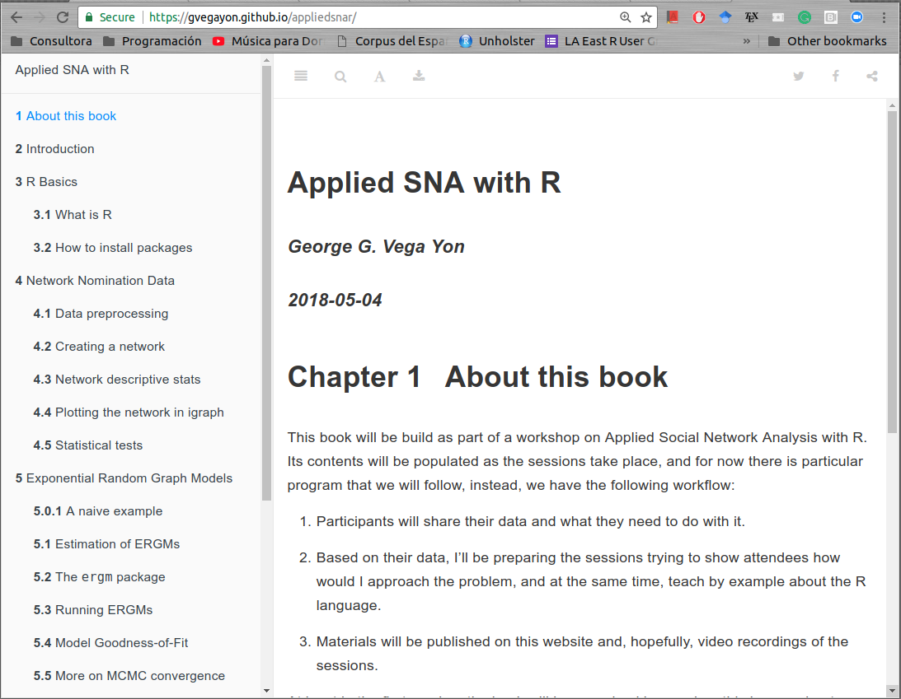
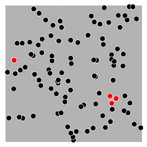

---
output:
  revealjs::revealjs_presentation:
    self_contained: true
    transition: fade
    theme: simple
    reveal_options:
      controls: false
      slideNumber: true
      margin: 0.05
      width: 1024
      height: 780
    css: "slides.css"
editor_options: 
  chunk_output_type: console
---

## netplot: Beautiful graph drawing

*   An alternative graph visualization engine that puts an emphasis on aesthetics at the same time of providing default parameters that provide visualizations that are out-of-the-box nice.

Some features:

*   Auto-scaling of vertices using sizes relative to the plotting device.
*   Embedded edge color mixer.
*   True curved edges drawing.
*   User-defined edge curvature.
*   Nicer vertex frame color.
*   Better use of space filling the plotting device.

The package uses the grid plotting system (just like ggplot2).

## Comparison

{style="width:600px"}

## UK Faculty

{style="width:600px"}

## Some features

Node scaling

{style="height:600px"}

## Some features

Node shapes

{style="height:600px"}

## Some features

Edge curvature

{style="width:800px"}

## Some features

Edge type of line

{style="height:600px"}

## US airports

{style="height:600px"}

## Applied Social Network Analysis with R

## Little ERGMs

The distribution of $\mathbf{Y}$ can be parameterized in the form

$$
\Pr\left(\mathbf{Y}=\mathbf{y}|\theta, \mathcal{Y}\right) = \frac{\exp{\theta^{\mbox{T}}\mathbf{g}(\mathbf{y})}}{\kappa\left(\theta, \mathcal{Y}\right)},\quad\mathbf{y}\in\mathcal{Y}
\tag{1}
$$

Where $\theta\in\Omega\subset\mathbb{R}^q$ is the vector of model coefficients and $\mathbf{g}(\mathbf{y})$ is a *q*-vector of statistics based on the adjacency matrix $\mathbf{y}$.

----

*   Model (1) may be expanded by replacing $\mathbf{g}(\mathbf{y})$ with $\mathbf{g}(\mathbf{y}, \mathbf{X})$ to allow for additional covariate information $\mathbf{X}$ about the network. The denominator,
    
    
    $$
    \kappa\left(\theta,\mathcal{Y}\right) = \sum_{\mathbf{z}\in\mathcal{Y}}\exp{\theta^{\mbox{T}}\mathbf{g}(\mathbf{z})}
    $$
    
*   Is the normalizing factor that ensures that equation (1) is a legitimate probability distribution.

*   Even after fixing $\mathcal{Y}$ to be all the networks that have size $n$, the size of $\mathcal{Y}$ makes this type of models hard to estimate as there are $N = 2^{n(n-1)}$ possible networks! 

## The lergm R package

*   An Extension of the `ergm` (regular size fitting via simulation) package

*   Uses exact statistics for fitting small networks (3 to 6 nodes).

*   Will be designed mostly to be ran with multiple networks simulatenously (so we recover the asymptotic properties of the MLE estimators)

*   Work in progress...

## Thanks!

*   netplot: https://github.com/USCCANA/netplot

*   Applied SNA with R: https://gvegayon.github.io/appliedsnar/

*   Little ERGMs: https://github.com/USCCANA/social-smarts/

Twitter: @gvegayon

email: vegayon@usc.edu